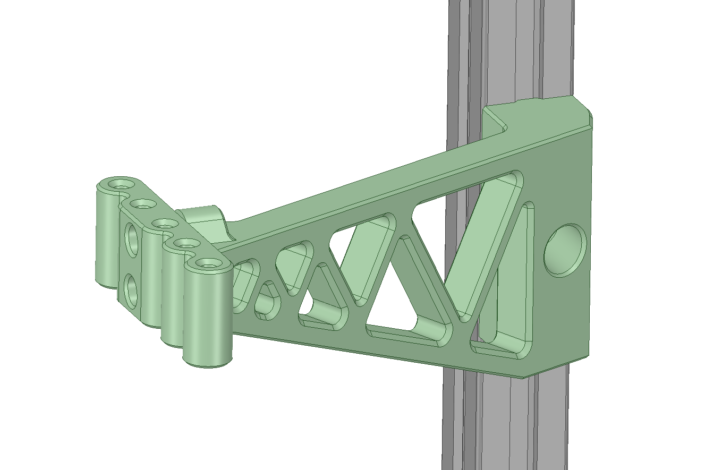
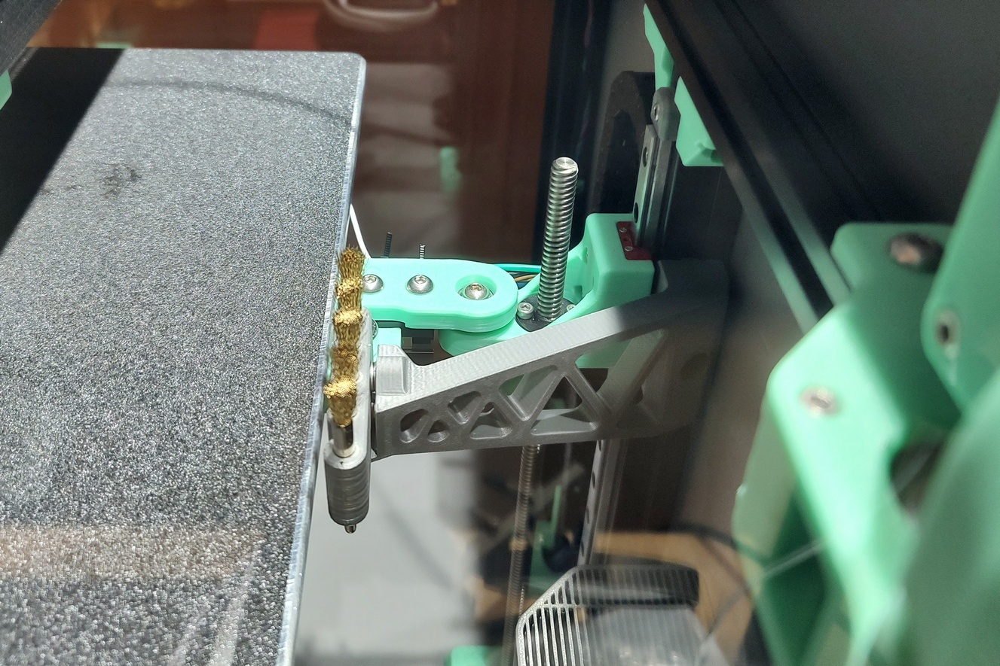
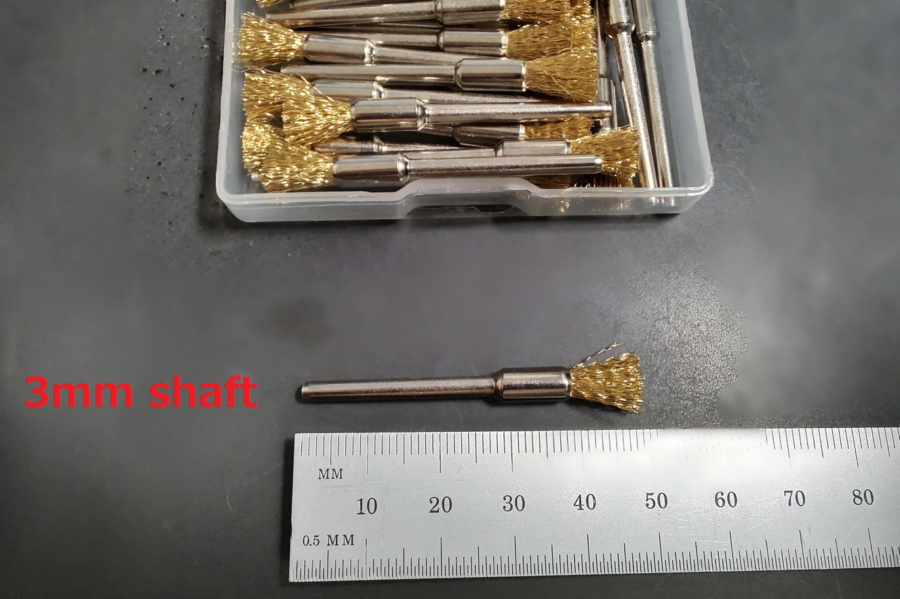

# SimpleNozzleWiper
Nozzle wiper for VORON Trident




## BOM
- M3 x 12mm SHCS x2
- M3 Insert Nut x2
- M3 Shim x6 (For position adjustment)
- M5 x 10mm BHCS or SHCS x1
- M5 T-Nut x1
- 3mm Shaft Wire Brush x5

## Configuration sample
```
[gcode_macro PRINT_START]
gcode:
    G28
    Z_TILT_ADJUST
    G28 X Y
    G0 X180 F4000 # for 300mm build
    G0 X260 F4000 # for 300mm build
    G28 Z
    G0 X150 Y150 Z30 F3600
```
